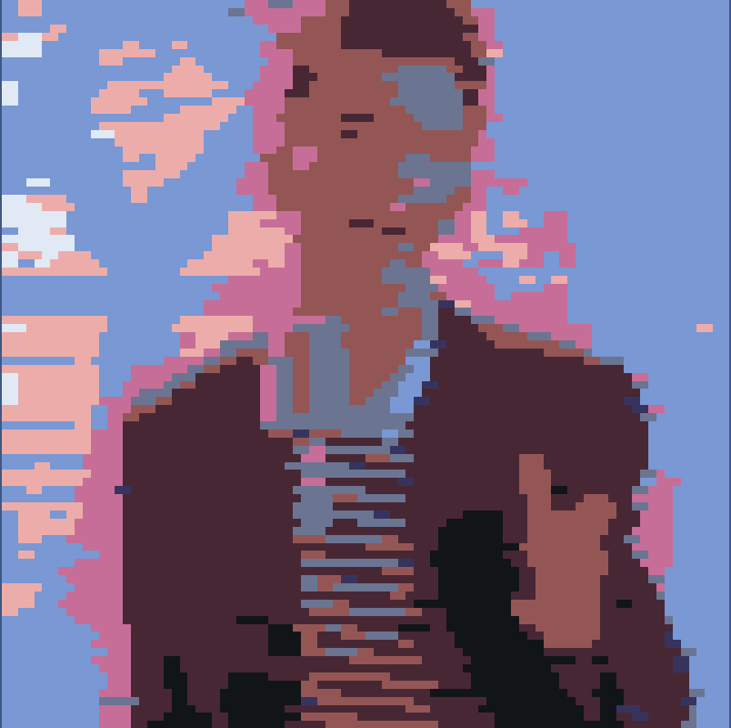
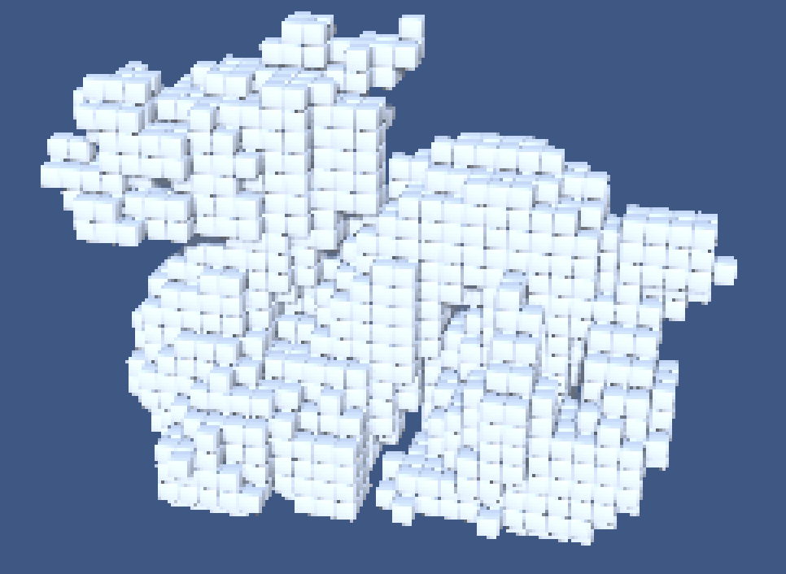

# Replicube Scripts

Scripts for importing media into Replicube

</img>
</img>

You will have to manually adjust the script to set the input, and output size. The values are at the top of the files for convenience.

> Note: Very messy, I practically shit these out just for POC.

## OBJ2RepliCube.py

**Converts a .pbj to a .vox**

Returns all voxels that would overlap any vertice in the OBJ point cloud.

## PNG2RepliPaint.py

**Converts a .png to a .pnt**

Returns rectangle bounds of color. Optimised through a greeedy algorithm.

## Get Replicube!
[Steam](https://store.steampowered.com/app/3401490/Replicube/)